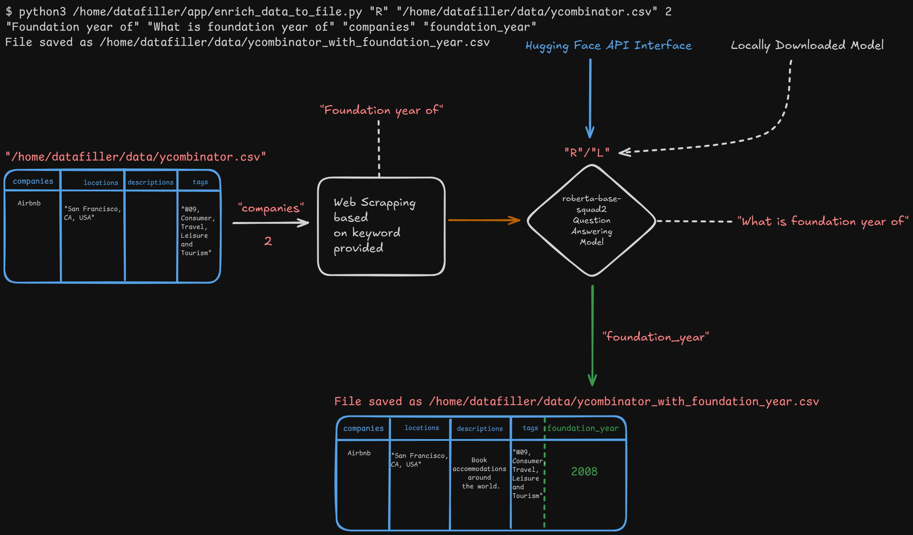
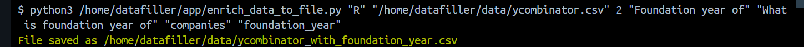
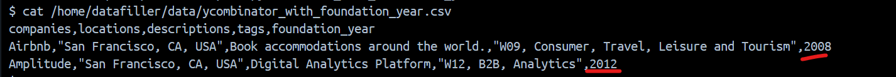

# dataFillerAI app Design




### Run dataFillerAI app in Docker Container
We are using official python image as base image which will create a container of Debian GNU/Linux machine and python3 with pip package manager in it.<br>
We will install all the required libraries for dataFillerAI app and run the app in container.

> [!NOTE]
> We are using pretained Question-Anwering model called roberta-base-squad2, find more details here
[Huggingface/roberta-base-squad2](https://huggingface.co/deepset/roberta-base-squad2)

#### Method 1 (Non-Customizable): Pull the prebuild image from Docker Hub and create container by using the image.
```
docker pull engnilesh/datafiller-ai:v1.0
```
----------------------------------------------------------------------------------------------------

#### Method 2 (Customizable): Build your own image by using Dockerfile

> github/engnilesh/dataFillerAI
[Docker file](https://github.com/apache/spark-docker/blob/6b917ced4279dd7b3a33a81a08db37b3f27e037b/3.5.4/scala2.12-java17-python3-ubuntu/Dockerfile)

> [!WARNING]
> This Dockerfile code is for development purpose only.


To `create and start the conatiner`, execute below command from you currenty directory where Dockerfile is present

#### Create a docker image from Dockerfile
```
cd /home/username/projects/dataFiller
docker build -t datafiller-ai .
```
> [!NOTE]
> Need to run the build image command with root user permissions


#### Start the container from the image created above
```
docker run --name datafiller-ai-container \
-p 8888:8888 \
-v /home/username/projects/dataFiller/app:/home/datafiller/app \
-v /home/username/data/ycombinator.csv:/home/datafiller/data/ycombinator.csv \
datafiller-ai
```

**Launch Jupyter Notebook**
<br>
If you want to run some adhoc code. You can launch Jupyter notebook in the container.

```
cd /home/username/projects/dataFiller/app/notebooks
jupyter notebook --ip="0.0.0.0"
```
>Access Jupyter notebook at following URL `http://localhost:8888`


**Usage of datafiller-ai app**
<br>
Once the container is running, you can run enrich_data_to_file script with the help of docker exec <br>
[Given Input Dataset](https://www.kaggle.com/datasets/harshikantdubey1/y-combinator-startups)

```
python3 /home/datafiller/app/enrich_data_to_file.py "R" "/home/datafiller/data/ycombinator.csv" 2 "Foundation year of" "What is foundation year of" "companies" "foundation_year"
```






#### To restart the stopped container
```
docker restart datafiller-ai-container
```

#### Stop the container
```
docker stop datafiller-ai-container
docker container rm datafiller-ai-container
```

#### Remove the docker image
```
docker image rm datafiller-ai
```